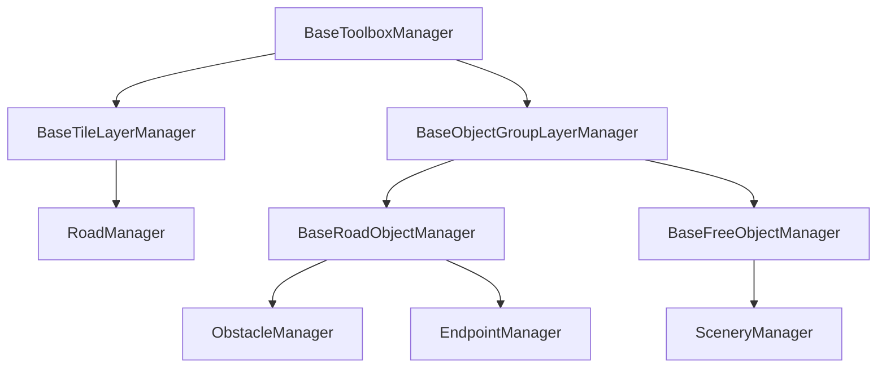

# Level Scene managers

The Level Scene (`index.ts`) is the level editor: it lets a developer draw
roads, place endpoints/obstacles/scenery, and drag them around. All of that
behaviour is split across a hierarchy of **manager** classes, one instance per
concrete manager, owned by the `Level` scene (`level.road`, `level.endpoint`,
`level.obstacle`, `level.scenery`).

Each concrete manager defines *what* it manages (its toolbox `box`, its
storage, its placement rules); the base classes define *how* the common
patterns work (claiming the toolbox, drag tracking, selection, ghost
previews). Concrete managers should stay focused on their own domain rules and
inherit everything else.

## Class hierarchy

## Base managers

### `BaseToolboxManager`

The root of every manager. Owns:

- The `box` this manager owns (e.g. `"road"`, `"obstacles"`, `"endpoints"`,
  `"scenery"`) - each concrete manager declares its own `box` getter.
- The currently selected `tool` within that box, read from `level.toolbox`.
- `claimToolbox(tool)`, which switches `level.toolbox` to this manager's box
  (so React mirrors the change and every other manager deactivates).
- `isDragging`, a flag every manager exposes so `Level.isDragging` can tell if
  *any* manager currently has a drag in progress.

### `BaseTileLayerManager`

Extends `BaseToolboxManager`. Shared logic for tools that are used by
click-and-dragging across multiple tiles rather than placing a single object.
Tracks the sequence of visited tiles, highlights them as they're visited,
accumulates the directions travelled through each tile (for classifying road
shapes), and hands the finished drag to the abstract `onDragEnd` hook.

- **Used by:** `RoadManager`.

### `BaseObjectGroupLayerManager`

Extends `BaseToolboxManager`. Shared logic for tools that place discrete
objects and let the player select a placed object to rotate or delete it via
a floating action-button stack (with tooltips). Generic over `Key`, whatever
identifies a placed object for the concrete manager (a tile for road objects,
the image itself for free objects).

Owns the delete/rotate buttons and their stack, `select`/`deselect`, and
positions the button stack under the selected object. Delegates the
domain-specific parts to abstract hooks: `getPlaced`, `validVariantKeys`,
`remove`, `rotate`, `handleGhost`, `highlightSelection`,
`clearSelectionHighlight`.

- **Used by (indirectly):** `BaseRoadObjectManager`, `BaseFreeObjectManager`.

### `BaseRoadObjectManager`

Extends `BaseObjectGroupLayerManager<..., Phaser.Types.Tilemaps.Tile>`. Shared
logic for tools that place exactly one object per road tile (facing a
particular direction/variant): tile-snapped ghost preview, dragging an
existing/new object from tile to tile, and picking the next variant when
rotating. Delegates `canPlace`, `getFactory` and `place` to subclasses.

- **Used by:** `ObstacleManager`, `EndpointManager`.

### `BaseFreeObjectManager`

Extends `BaseObjectGroupLayerManager<..., Phaser.GameObjects.Image>`. Shared
logic for tools that place objects freely (not snapped to a tile), dragged via
Phaser's native object-dragging, that must not overlap roads, endpoints, or
each other. Owns the overlap checks, ghost preview, and pointer handlers for
adding/dragging objects, plus deleting objects that end up overlapping a
newly-added road or endpoint. Delegates `layerName`, `maxLength` and
`getFactory` to subclasses.

- **Used by:** `SceneryManager`.

## Concrete managers

### `RoadManager` (`box: "road"`)

Draws/erases road tiles by dragging across the tilemap (`BaseTileLayerManager`
with `"add" | "delete"` tools). Tracks the directions each road tile connects
to (`_dirs`), derives the road's tile ID/shape from those directions, and
exposes `dirs`/`ids` for other managers (obstacles/endpoints) to determine
which facings/variants are valid on a given road tile.

### `ObstacleManager` (`box: "obstacles"`)

Places a single obstacle per road tile (`BaseRoadObjectManager`). Determines
which facing variants are valid from the road tile's shape (straight tiles
only allow facing along their axis; turns/T-junctions/crossroads allow any of
the 4 cardinal facings). Listens for roads being deleted or endpoints being
added to remove obstacles that no longer have a valid tile.

### `EndpointManager` (`box: "endpoints"`)

Places house or CFC endpoints on road tiles (`BaseRoadObjectManager`). The
most complex concrete manager: tracks each endpoint's main tile plus any
"crossover" tiles it also occupies, enforces that only one CFC endpoint can
exist at a time, and resolves collisions between house/CFC variants sharing a
crossover tile via `_houseToHouseVariantCollisions`/`_houseToCfcVariantCollisions`.

### `SceneryManager` (`box: "scenery"`)

Places free-standing scenery objects anywhere that doesn't overlap a road,
endpoint, or other scenery object (`BaseFreeObjectManager`). Scenery objects
currently have only a single variant per id (no rotation). Reports the
current/max object counts to React via the `sceneryObjectCount` and
`maxSceneryObjectCount` variables.
